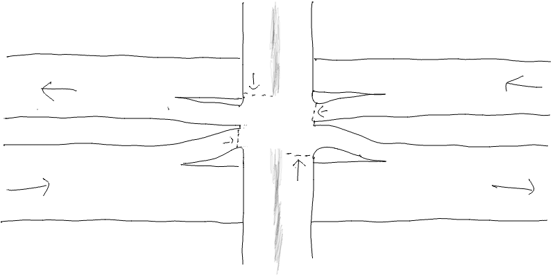
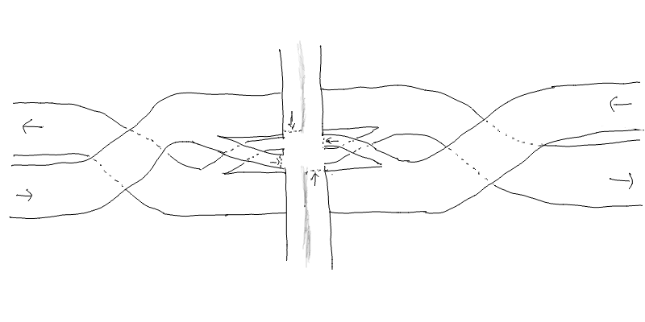
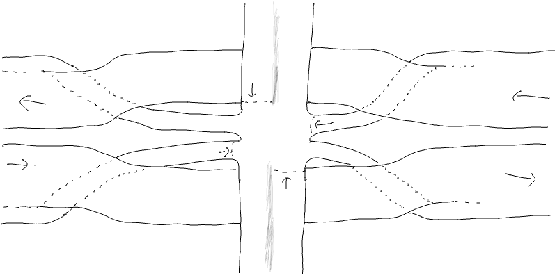

```info 
name: Interchange proposals
```

# Problem

We have a main road (such as a major highway) and another road (such
as a normal city road), and we want to provide an access point between
them without severly impacting traffic flow on the main road.

For example, we simply create an intersection between them, but if
intersecting a city road and a highway, this will impede traffic on
the highway. 

There are many available designs for this, a few more elaborate
examples of which can be found at [text](node:Interchange examples). For
now, we want to focus on those that create only a single intersection
in the city road, and only use onramps and offramps to get to the
major road.

# State of the art

This is the original single-point urban interchange design (or "SPUI"): 


  
It is believed both efficient and safe, but it takes up a lot of room.

This is a much more compact design--the "inverted SPUI". 



It has similar qualities to the original SPUI, except it requires
drivers to enter and exit the main road using the left lane, which
creates severe confusion.

# Proposals

We want the best of both worlds: 

* Drivers leaving the main road use the right lanes to exit

* There is only one, normal-sized intersection on the city road.

This is topologically feasible, and we present two designs that
accomplish this

First, the Twisted SPUI: 



However, this requires either raising or the entire halves of the
major road, which could be expensive. Therefore, we also present the
inside-out SPUI:



Here, only a single lane needs to be elevated or tunnelled.
